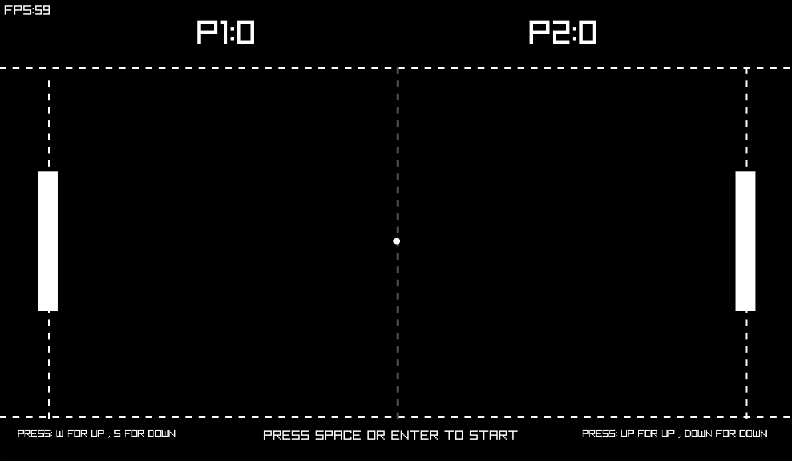

# PONG!
this is a simple implemantation of pong with [Raylib](https://www.raylib.com/index.html) and C/C++
*mainly following [this youtube tutorial](https://youtu.be/LvpS3ILwQNA) with many improvments mainly for visuals 

